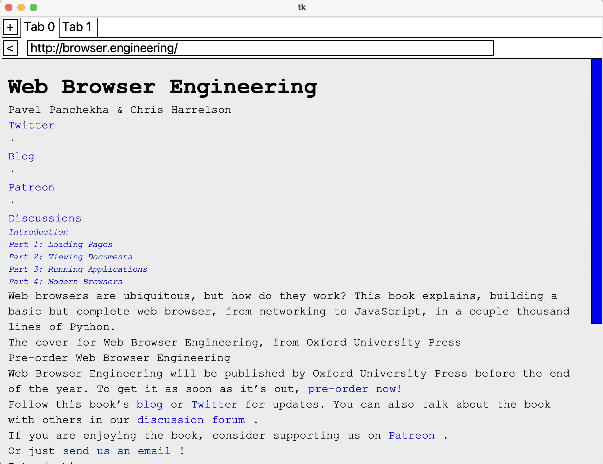

This project is a Python implementation of the [Web Browser Engineering](http://browser.engineering) course. The program builds and launches a basic (and incomplete) web browser from scratch in Python, using `tkinter` to build the GUI.

It can request web pages, parse HTML and some CSS, and supports multiple tabs. You can navigate by clicking links, but the browser cannot yet parse JavaScript or send information to a server.



### Installation

Ensure you have [rye](https://rye.astral.sh/) installed. Clone this repo, then run:

```
$ rye init
```

### Run browser

You can run the browser by running the following commands from the root directory.

To launch the browser with `URL` as the homepage:

```
$ rye run python src/browser.py <URL>
```

To launch the browser and display a HTML file:

```
$ rye run python src/browser.py <FILENAME>
```

To launch the browser and display the source code of `URL`:

```
$ rye run python src/browser.py view-source:<URL>
```

### Run tests

Test cases are in the `tests` directory. To run all tests:

```
$ rye test
```

### Architecture

The browser uses `tkinter` as the GUI; its main loop is initiated in `browser.py`.

#### Classes

TODO: document these classes and their utilities

- `Chrome`
- `Browser`
- `Tab`
- `URL`
- `LineLayout`
- `InputLayout`
- `BlockLayout`
- `DocumentLayout`
- `HTMLParser`
- `CSSParser`
- `Draw`
